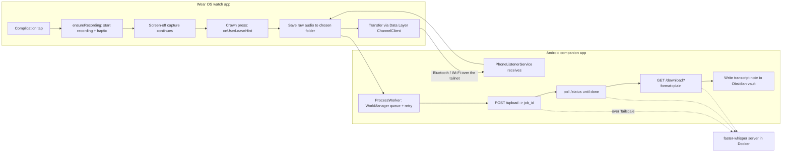

# VoiceNote Capture — Architecture

Status: Phase 1 prototype + the Phase 2 hardware items (watch→phone link,
complication launch, always-start / crown-stop activation, real haptics) all
verified on real hardware as of 2026-06-05.

## Overview

Three actors: a **Wear OS watch app** (`:wear`), an **Android phone companion app**
(`:mobile`), and a **transcription endpoint** (a separate faster-whisper Docker
server, reached over Tailscale). The phone app is endpoint-agnostic and
content-agnostic: it sends audio to one configured base URL and writes whatever text
comes back into the Obsidian vault. What the endpoint does internally is out of
scope for this repo.

## Components & responsibilities

### Watch app (`:wear`)
- **Activation (revised in Phase 2 after on-watch testing):** complication tap
  always starts a recording; crown press always stops and exits. `launchMode=
  singleTask` + `finish()`-on-stop means every launch is a clean `onCreate` →
  `ensureRecording`; `RecordingService.ACTION_START` is idempotent so the same
  path is used whether the app was cold or warm. The crown press is caught via
  `onUserLeaveHint` (deliberately, so that screen timeout — which does not fire
  this hook — keeps capture running). The original launch-toggle model (Phase
  0.5 spike: onCreate=start, onNewIntent=toggle) was abandoned after real-watch
  testing showed toggle-drift when the activity outlived a session. Background:
  Phase 0 had disproved intercepting hardware key events directly; Phase 1
  shipped the toggle model on an emulator; Phase 2 replaced it with this
  always-start / crown-stop model and added a watch-face complication
  (`VoiceNoteComplicationService`) as the canonical launch path on the original
  Pixel Watch (whose single crown is not user-mappable to a third-party app).
- **Launch surfaces:** the watch-face complication (preferred — one tap from
  any face with a spare slot), the launcher icon in the app drawer, and the
  PW4 side button once the owner upgrades (no app change required; OEM
  button-mapping setting). There is no on-screen toggle button; the redesigned
  recording screen has no idle / stopped state and is shown only while
  recording.
- **Recording UI:** Option A "Pure Minimal" handoff
  (`design_handoff_recording_screen/`): pure-black background, blinking red
  status dot + uppercase "RECORDING" label at top, hero m:ss timer (tabular
  digits) centered, live mic-amplitude waveform via `WaveformView` (40 rounded
  red bars, edge-faded, fed by `RecordingService` sampling
  `MediaRecorder.getMaxAmplitude()` every 40 ms through a `RecordingState`
  singleton), and a "Press crown to stop" hint at the bottom. Dot blink and
  waveform / timer ticks run only between onResume / onPause so screen-off
  stops the UI work without stopping the capture.
- **Capture:** `RecordingService`, a microphone foreground service (mandatory on
  Android 14+, declared type `microphone` + matching permission). Records mono
  16 kHz AAC/m4a to local storage. Optional max-duration auto-stop (off by
  default). Started only from the foreground activity — a mic FGS cannot start
  from the background (RECORD_AUDIO is while-in-use).
- **Haptics:** `VibrationEffect.EFFECT_HEAVY_CLICK` on start, `EFFECT_DOUBLE_CLICK`
  on stop, fired with `AudioAttributes.USAGE_ASSISTANCE_SONIFICATION` so DND /
  silent profiles don't filter them. Predefined effects map to the device's
  tuned vibrator profile — perceptible on the Pixel Watch motor; the earlier
  60ms raw waveform was not. Pre-API-29 fall-back is a longer one-shot /
  waveform. Screen stays off during the recording session.
- **Transfer:** `WearTransfer` sends the finished file to the phone via the Wear
  Data Layer `ChannelClient`, locating the phone by a capability
  (`voicenote_phone`) registered at runtime in :mobile via
  `CapabilityClient.addLocalCapability` (manifest meta-data was observed being
  silently ignored by GMS Wearable on the test phone — switched to dynamic
  registration). With no phone reachable, `WearTransfer` logs and leaves the
  file on the watch.

### Phone app (`:mobile`)
- **Receive:** `PhoneListenerService` (a `WearableListenerService`) receives the
  audio over the Data Layer channel.
- **Persist raw:** saves a copy to the user-chosen raw-audio folder (SAF), before
  any upload, so nothing is lost on endpoint failure.
- **Process:** `ProcessWorker` (a `CoroutineWorker`) runs the asynchronous
  transcription protocol with retry/backoff, then writes the returned text into the
  user-chosen Obsidian vault folder (SAF). Mock mode skips the network.
- **Settings:** `SettingsActivity` + `Settings` — endpoint base URL, auth token,
  mock mode, raw + vault folders (SAF tree URIs with persisted permission).

### Transcription endpoint (separate project, out of scope here)
- faster-whisper Flask server in Docker; reached over Tailscale at a stable MagicDNS
  hostname. Transcribes and returns text. The app treats it as a black box.

## Endpoint contract (asynchronous)

```
POST {base}/upload            multipart, field "audio"      -> { "job_id": "..." }
GET  {base}/status/{job_id}   status in:
                              queued | loading_model | transcribing | done | error
GET  {base}/download/{job_id}?format=plain                  -> plain transcript text
```

- On `done`: download `format=plain`, write to vault.
- On `error`: log the server's `error` field, clear the persisted job id, retry.
- Auth: optional Bearer token header. The Tailscale network is the transport
  security boundary.

## Data flow



## Robustness

- Per-call HTTP timeouts (connect/upload/status/download).
- Job id persisted per audio path → a resumed worker continues polling instead of
  re-uploading a large file.
- Per-execution poll budget keeps each run under WorkManager's ~10 min cap; the job
  resumes on the next execution.
- `MAX_RUN_ATTEMPTS = 5` bounds runaway retries (note: it also bounds total job
  duration to ~5 poll windows — raise it or switch to an error-only counter for very
  long jobs).
- Raw audio saved before upload, so an endpoint failure never loses the recording.

## Settings

- Activation: complication-tap always-start + crown-press always-stop. No
  on-screen toggle.
- Max-duration auto-stop (watch): off by default; minutes when on.
- Audio: mono 16 kHz AAC default.
- Raw-audio folder (phone, SAF).
- Processing endpoint base URL; optional auth token.
- Output Obsidian vault folder (phone, SAF).

## Security & privacy

- Default path keeps audio within owned infrastructure: watch → phone → home server
  over Tailscale. Nothing goes to a third-party cloud.
- `targetSdk` 34 blocks cleartext HTTP by default; `network_security_config.xml`
  permits it **only** for the Tailscale host (the tunnel provides transport
  encryption). All other hosts remain HTTPS-only.

## Out of scope

- Transcription-server internals; summary/to-do extraction (intentionally not built
  — the user does the summarising); backups; cloud-synced folders; Tailscale config.

## Open items

- Final audio format vs ASR compatibility (faster-whisper accepts the m4a fine in
  testing; a few short / quiet takes have come back with empty transcripts —
  needs a separate investigation against the server, not the watch link).
- Remaining Phase 2 hardware item: real-world battery measurement during
  sustained recording. (Watch→phone Data Layer link, complication, always-start /
  crown-stop activation, and real haptics are all verified on hardware
  2026-06-05; direct hardware-button binding is parked for the PW4 upgrade.)
