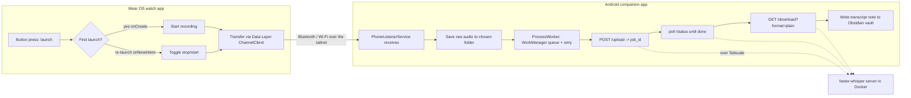

# VoiceNote Capture — Architecture

Status: Phase 1 prototype, phone pipeline validated end-to-end.

## Overview

Three actors: a **Wear OS watch app** (`:wear`), an **Android phone companion app**
(`:mobile`), and a **transcription endpoint** (a separate faster-whisper Docker
server, reached over Tailscale). The phone app is endpoint-agnostic and
content-agnostic: it sends audio to one configured base URL and writes whatever text
comes back into the Obsidian vault. What the endpoint does internally is out of
scope for this repo.

## Components & responsibilities

### Watch app (`:wear`)
- **Activation:** single hardware button via the launch path. `launchMode=singleTask`
  means first launch hits `onCreate` (start recording); each re-launch hits
  `onNewIntent` (toggle stop/start). A hardware button assigned to the app produces
  these launches. On-screen tap is the guaranteed fallback. (Confirmed in spike
  Phase 0.5; Phase 0 had disproved intercepting hardware key events directly.)
- **Capture:** `RecordingService`, a microphone foreground service (mandatory on
  Android 14+, declared type `microphone` + matching permission). Records mono
  16 kHz AAC/m4a to local storage. Optional max-duration auto-stop (off by default).
  Started only from the foreground activity — a mic FGS cannot start from the
  background (RECORD_AUDIO is while-in-use).
- **Haptics:** distinct start (single pulse) / stop (double pulse); screen stays off.
- **Transfer:** `WearTransfer` sends the finished file to the phone via the Wear
  Data Layer `ChannelClient`, locating the phone by a declared capability
  (`voicenote_phone`). With no phone reachable it logs and leaves the file on the
  watch.

### Phone app (`:mobile`)
- **Receive:** `PhoneListenerService` (a `WearableListenerService`) receives the
  audio over the Data Layer channel.
- **Persist raw:** saves a copy to the user-chosen raw-audio folder (SAF), before
  any upload, so nothing is lost on endpoint failure.
- **Process:** `ProcessWorker` (a `CoroutineWorker`) runs the asynchronous
  transcription protocol with retry/backoff, then writes the returned text into the
  user-chosen Obsidian vault folder (SAF). Mock mode skips the network.
- **Settings:** `SettingsActivity` + `Settings` — endpoint base URL, auth token,
  mock mode, raw + vault folders (SAF tree URIs with persisted permission).

### Transcription endpoint (separate project, out of scope here)
- faster-whisper Flask server in Docker; reached over Tailscale at a stable MagicDNS
  hostname. Transcribes and returns text. The app treats it as a black box.

## Endpoint contract (asynchronous)

```
POST {base}/upload            multipart, field "audio"      -> { "job_id": "..." }
GET  {base}/status/{job_id}   status in:
                              queued | loading_model | transcribing | done | error
GET  {base}/download/{job_id}?format=plain                  -> plain transcript text
```

- On `done`: download `format=plain`, write to vault.
- On `error`: log the server's `error` field, clear the persisted job id, retry.
- Auth: optional Bearer token header. The Tailscale network is the transport
  security boundary.

## Data flow



## Robustness

- Per-call HTTP timeouts (connect/upload/status/download).
- Job id persisted per audio path → a resumed worker continues polling instead of
  re-uploading a large file.
- Per-execution poll budget keeps each run under WorkManager's ~10 min cap; the job
  resumes on the next execution.
- `MAX_RUN_ATTEMPTS = 5` bounds runaway retries (note: it also bounds total job
  duration to ~5 poll windows — raise it or switch to an error-only counter for very
  long jobs).
- Raw audio saved before upload, so an endpoint failure never loses the recording.

## Settings

- Activation: single-button launch-toggle (fixed); on-screen tap fallback always
  available.
- Max-duration auto-stop (watch): off by default; minutes when on.
- Audio: mono 16 kHz AAC default.
- Raw-audio folder (phone, SAF).
- Processing endpoint base URL; optional auth token.
- Output Obsidian vault folder (phone, SAF).

## Security & privacy

- Default path keeps audio within owned infrastructure: watch → phone → home server
  over Tailscale. Nothing goes to a third-party cloud.
- `targetSdk` 34 blocks cleartext HTTP by default; `network_security_config.xml`
  permits it **only** for the Tailscale host (the tunnel provides transport
  encryption). All other hosts remain HTTPS-only.

## Out of scope

- Transcription-server internals; summary/to-do extraction (intentionally not built
  — the user does the summarising); backups; cloud-synced folders; Tailscale config.

## Open items

- Watch→phone Data Layer transfer is implemented but untested on hardware (Phase 2).
- Final audio format vs ASR compatibility (faster-whisper accepts the m4a fine in
  testing).
- Phase 2 hardware items: button binding, battery, haptic feel.
