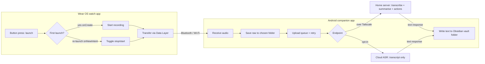

# Voice Note Capture — Architecture

**Status:** Prototype / living document.

## Overview

Three actors: a **Wear OS watch app**, an **Android phone companion app**, and a **processing endpoint** (the home server by default; a cloud transcript service optionally).

The phone app is **endpoint-agnostic and content-agnostic**: it sends an audio file to one configured endpoint and writes whatever text comes back into the Obsidian vault. What the endpoint does internally is out of scope.

## Components & responsibilities

### Watch app (Wear OS)
- Capture: single hardware button (assigned to the app) via the launch path —
  first press starts, each subsequent press toggles stop/start
  (onCreate / onNewIntent, launchMode=singleTask). On-screen tap = guaranteed
  fallback. Confirmed in Phase 0.5 (Phase 0 disproved hardware key events).
- Distinct haptics; screen off.
- Record audio (mono 16 kHz AAC/m4a default) to local storage; optional max-duration auto-stop.
- Transfer audio to the phone via Data Layer `ChannelClient`; then idle.
- No network, no processing. Works phone-off (buffers locally, syncs on reconnect).

### Phone companion app (Android)
- Receive audio over the Data Layer.
- Persist raw audio immediately to a user-chosen folder (independent of processing; survives failures).
- Upload queue (retry; async job + poll) → POST audio to the configured endpoint.
- Write the returned text into the user-chosen Obsidian vault folder.
- Holds all settings.

### Processing endpoint (internals out of scope)
- **Default:** home server, reached over Tailscale. Transcribes + does any post-processing (summary, action lists, to-do population, etc.) and returns text. Black box to the apps.
- **Optional:** cloud ASR service (transcript only).

## Endpoint contract (defined by the app; the server implements it)
- **Request:** HTTP POST, multipart audio file (+ optional metadata: timestamp, device id).
- **Response (short jobs):** JSON `{ "text": "..." }`.
- **Response (long jobs):** `{ "job_id": "..." }`, then GET poll → `{ "status": "...", "text": "..." }`.
- **Auth:** configurable header/token. The Tailscale network is the primary security boundary.
- **Cloud providers:** per-provider adapters (e.g. OpenAI Whisper / Groq / Deepgram) map to the same internal text result.

## Data flow

## Settings
- **Activation:** single-button launch-toggle (fixed model); on-screen tap fallback always available.
- **Max-duration auto-stop:** off (default); minutes when on.
- **Audio:** format / sample rate (defaults: mono 16 kHz AAC).
- **Raw-audio folder** (phone).
- **Processing endpoint:** home server URL (default) | cloud provider + key.
- **Endpoint auth token** (optional).
- **Output Obsidian vault folder.**

## Security & privacy
- Default path keeps audio within owned infrastructure: watch → phone → home server over Tailscale. Nothing leaves owned devices.
- Cloud option is opt-in and transcript-only; flagged in the UI as the lower-privacy path.

## Out of scope
- Server-side processing internals; backups; cloud-synced folders; to-do population; Tailscale config (already deployed).

## Open items
- Phase 2 (hardware): binding a physical OnePlus button to the app (Settings → button mapping).
- Final audio format vs ASR compatibility.
- Async job vs blocking request for short clips.
- Core library desugaring to be enabled in Phase 1 (java.time / streams safety); pin desugar_jdk_libs via the version catalogue.
